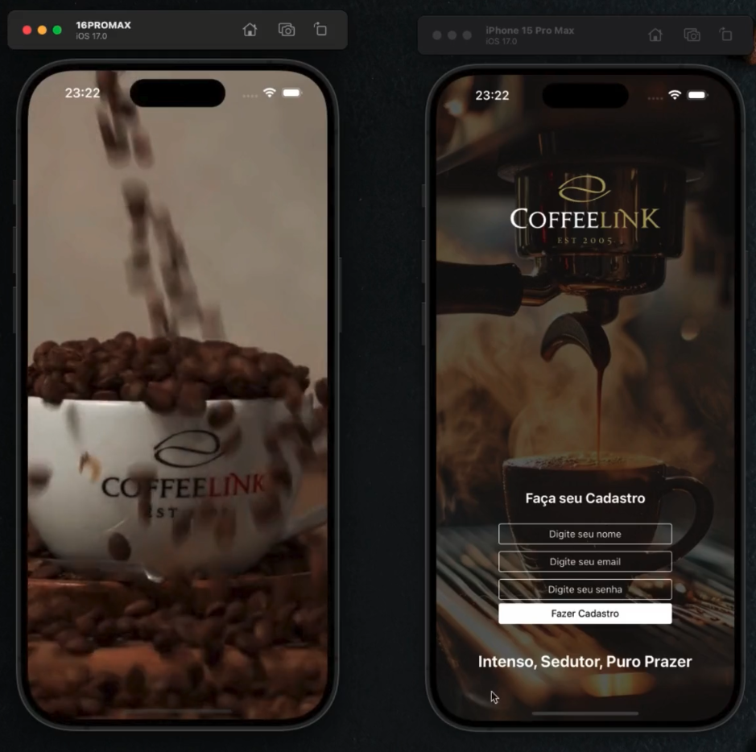

# Splash-Screen with  Video
### Easily integrate videos into your app!

The Video component from expo-av allows you to display videos natively alongside other UI elements. 📱🔥 Plus, it shares many APIs with Audio, providing a complete and customizable experience.

Want to set up videos quickly and explore advanced features? Check out the documentation and take your app to the next level! 🚀

## [Expo Docs](https://docs.expo.dev/versions/latest/sdk/video-av/)

